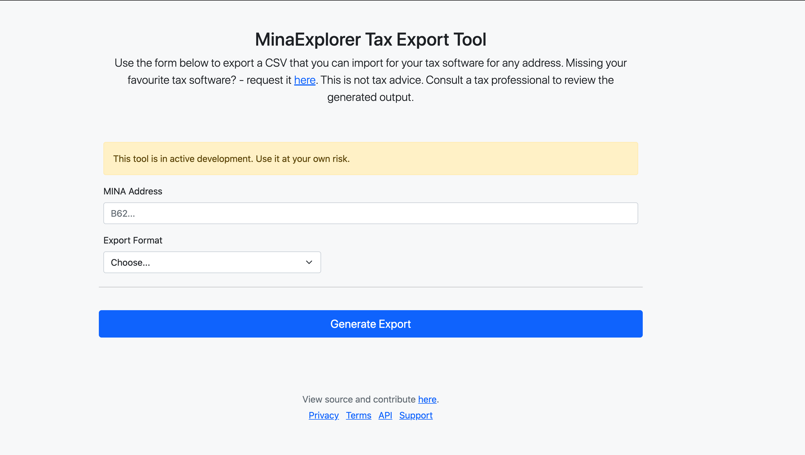

# MinaExplorer Exporter Tool

A repository for exporting data from MinaExplorer for popular tax software. This is a tool to aid exporting in the format required for each software, it is **not** tax advice and you should manually review any export.

Currently this will only generate an export of all transactions (not fee transfers) in a Koinly supported format. This will work in the current format if you are receiving staking rewards from a pool. Next steps:

* Add fee transfers (coinbase and snark fee rewards)
* Add other export formats for popular software
* Allow customization to detect the pool payout to label it correctly (currently it looks for MinaExplorer pool format which includes "Payout")

